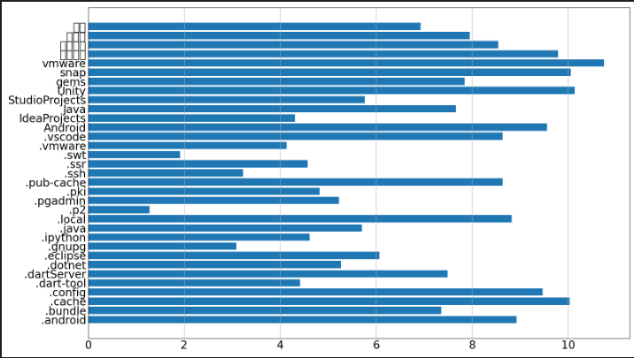

# 챕터 1 폴더 크기 측정 프로그램
1. 파이썬 개발환경 설정
2. 폴더 크기 측정 
3. 측정 데이터 시각화

## 1.1 파이썬 개발환경 설정
운영체제 : 우분투 24.04 LTS
IDE : VScode
파이썬 버전 : 3.12.3 

혼공단 파이썬을 배우면서 남아있던 파이썬 개발환경이 남아있어서 주피터쪽만 익스텐션으로 추가하면 설치가 끝!

## 1.2 폴더 크기 측정

### 모듈과 패키지 그리고 라이브러리란?
모듈이란 : 소스코드 파일이며 import명령어를 이용하여 다른 모듈에서 작성된 데이터 변수 함수를 클래스를 받아와 활용할 수 있는 파일 

패키지 :여러개의 모듈을 기능이나 성격별로 분류하여 하나의 폴더에 저장한 것을 패키지라 함

라이브러리 : 다양한 기능을 제공하는 여러개의 패키지를 묶은 것을 의미함

크기별로 차이 : 라이브러리 > 패키지 > 모듈


#### 코드 사용방법 및 설명 자세히
오랜만에 파이썬을 사용하니 사용법이 기억도 안나고 간단하게 적혀있어서 어떤 방식으로 사용 하는지 잘 모르겠네요

따라서 하나하나 열심히 분석하면서 공부해보겠습니다.

```python
# from 패키지 이름 import 사용할 클래스 가져오기
from pathlib import Path
import json

#클래스를 사용하여 객체를 생성하고 속성과 메소드를 사용하기
WORK_DIR = Path(__file__).parent

"""
클래스 사용법
클래스('....')은 객체를 만드는 생성자를 호출
클래스.속성
클래스.메서드() 
 
Path(__file__)을 이용해 파일 경로를 객체로 만들어내고
Path(__file__).parent Path클래스의 parent속성으로 상위 폴더를 불러옴
WORK_DIR = Path(__file__).parent
WORK_DIR 에 현재 파일의 상위 폴더위치를 저장함
"""
OUT_DIR = WORK_DIR / "output"
# WORK_DIR경로/output 경로를 OUT_DIR에 저장함

if __name__ == "__main__":
    OUT_DIR.mkdir(exist_ok=True)

"""
if __name__ == "__main__" 의 경우 직접 실행될때만 실행하게 하는 구문
OUT_DIR.mkdir(exist_ok=True)은 OUT_DIR변수에 저장되어있는 경로에
mkdir :폴더를 생성하라
(exist_ok=True) : 폴더가 이미 존재해도 오류 없이 넘어가라
"""

def get_total_filesize(basedir: Path, pattern: str = "*") -> int:
"""
파일사이즈를 측정하는 함수를 정의함
basedir에 Path객체 저장
pattern에 기본값은 "*" 모든값을 저장하라
-> int: 반환값은 인트로 반환해라
"""
    total_bytes = 0
    for fullpath in basedir.glob(pattern):
    #glob()안에 입력된 값을 이용하여 패턴과 일치한 파일명을 리스트로 반환합니다. 
    #fullpath는 각각의 항목들을 나타내는 객체
        if fullpath.is_file():

            total_bytes += fullpath.stat().st_size
            """
            fullpath.stat() : 파일의 정보를 담고있는 객체를 반환함
            .st_size :위 의 정보중에서 파일의 크기를 반환함
            total_bytes += fullpath.stat().st_size
            총 파일의 크기들을 모두 더함
            """
    return total_bytes


if __name__ == "__main__":
    base_dir = WORK_DIR
    filesize = get_total_filesize(base_dir, pattern="*")
    #현재 폴더의 상위폴더 내의 모든 이름의 파일들의 사이즈를 더해서 filesize에 저장하라
    print(f"{base_dir.as_posix()=},{filesize} bytes")
    """
    4. print(f"{base_dir.as_posix()=},{filesize} bytes")
    f"{x=}"  :  x= 값의 형태로 출력함
    base_dir.as_posix()=  : base_dir의 경로를 문자열로 출력
    """


OUT_2_3 =OUT_DIR /f"{Path(__file__).stem}.json"

def dump_dirnames(basedir: Path) -> None:
    dirs = []
    for path in basedir.iterdir():
    #basedir.iterdir() : basedir 안에 있는 모든 파일과 하위 목록을 반환함   #for 문을 이용하여 basdir내의 모든 항목을 path로 하나씩 반환함
        if path.is_dir():
        #is_dir() : path가 디렉토리이면 True, 아니면 False를 반환합니다.
            dirs.append(path.as_posix())
            #path가 디렉토리이면, path.as_posix() 메서드를 사용하여 해당 디렉토리의 경로를  dirs 리스트에 추가
    dirs_sorted = sorted(dirs)
    #dirs 리스트에 수집된 모든 디렉토리 이름(문자열)을 알파벳 순서로 오름차순 정렬
    with open(OUT_2_3, "w", encoding="utf-8") as fp:
    """
    with open(...)  : with 문을 사용하여 ... 파일을 조작하고 
    as fp : 열린 파일 객체를 fp라는 변수로 사용
    OUT_2_3 : JSON파일 경로
    "w" :쓰기모드로 파일 열기
    encoding="utf-8" : 파일 인코딩을 utf-8f로 ㅓ장
    """
        json.dump(dirs_sorted, fp, ensure_ascii=False, indent=2)
        """
        json.dump : 파이썬 객체를 JSON형식으로 파일에 쓰게하는 함수
        dirs_sorted : JSON으로 변환하여 저장할 데이터
        fp : 데이터를 쓸 파일 객체
        ensure_ascii=False : 아스키 코드가 아닌 유니코드 문자로 인코딩함
        indent=2 : 들여쓰기 적용
        """


def load_dirnames() -> list[str]:
    #-> list[str]: 반환값이 리스트로 반환하라
    if OUT_2_3.is_file():
        #OUT_2_3이라는 파일이 있다면
        with open(OUT_2_3, "r", encoding="utf-8") as fp:
            #with구문 "r" :읽기 모드로 열어서 
            return json.load(fp)
            #파일 안의 내용을 JSON으로 파싱해서 반환해라
    return []


def dump_filesize_from_dirnames():
    dirs = load_dirnames()
    result = {}
    for path_str in dirs:
    # 불러온 디렉토리 이름 목록을 하나씩 순회함
        path = Path(path_str)
        filesize = get_total_filesize(path, pattern="**/*")
        #현재 디렉토리(path)의 모든 파일의 총 크기를 계산함
        result[path.as_posix()] = filesize
        #path.as_posix()를 키로 filesize를 값으로 사용하여 result에 저장함
        with open(OUP_2_4, "w", encoding="utf-8") as fp:
            json.dump(result, fp, ensure_ascii=False, indent=2)

```

## 1.3 측정 데이터 시각화

### mathplotlib사용법과 코드 분석

```python

OUT_3_1 = OUT_DIR / f"{Path(__file__).stem}.json"
#Path(__file__).stem : 현재 실행중인 파일이름에서 접미사(.exe ,.py등)을 빼고 사용함

def dump_plot_data():
    size_per_path = load_filesize_from_dir()
    
    size_per_stem = {Path(path).stem: size for path,
                      size in size_per_path.items()
                      if size>0}
    """
    Path(path).stem : 경로의 마지막 디렉토리 이름만 추출
    size in size_per_path.items() if size>0 : 파일크기가 0보다 큰 디렉토리만 표시
    """
    plot_data = dict(
        stem=list(size_per_stem.keys()),
        size=list(size_per_stem.values())
    )
    #키에 모든 디렉토리 이름 ,값에 모든 디렉토리 크기를 저장함
    with open(OUT_3_1, "w", encoding="utf-8") as fp:
        json.dump(plot_data, fp, ensure_ascii=False, indent=2)
        #plot_data를 JSON으로 저장

plot_data = load_plot_data()
fig,ax=plt.subplots()
#plt.subplots() :하나의 그래프를 가진 그림(fig)을 생성하고 축을 ax에 할당함
ax.barh(plot_data["stem"], plot_data["size"])
#ax.barh (1,2) : 가로 막대 그래프를 그림 , 
# 1: Y축으로 사용될 리스트 ,2: X축으로 사용될 리스트

fig.savefig(OUT_DIR / f"{Path(__file__).stem}.png")
#fig.savefig() :생성된 그림을 저장함

plot_data = load_plot_data()
log_size = np.log10(plot_data["size"])
#np.log10 : numpy를 이용하여 로그 10을 적용해서 크기 차이를 상대적으로 변화시킴
#데이터 크기가 차이가 큰 경우 로그를 이용해 보기 좋게 만드는게 좋다
fig, ax = plt.subplots(figsize=(16, 9),dpi=100)
#figsize : 가로,세로 크기를 조정함
#dpi : 해상도를 설정 
ax.barh(plot_data["stem"], log_size)
ax.grid(True,axis='x')
#차트에 그리드(격자)을 출력함 x축만 추가한 상태 
ax.tick_params(labelbottom=True, length=0, labelsize=20)
#축의 눈금과 레이블 설정
fig.set_layout_engine('tight')
# 그림이 잘리지 않도록 여백을 최적화함
fig.savefig(OUT_DIR / f"{Path(__file__).stem}.png")

```


## 추가 사항 
리눅스의 경우 한글 폰트가 잘 안되어 있어 그래프를 그리면 다음과 같이 글씨가 깨저보입니다.


이를 해결하기 위해선 나눔폰트를 설치하고 추가적인 코드를 통해 mathplotlib에서 폰트를 인식하게끔 만들어줘야합니다.

우선 리눅스에서의 나눔폰트를 설치하시고

```bash
sudo apt update
sudo apt install fonts-nanum
```
설치후엔 캐시를 다시 빌드합니다.
```bash
fc-cache -fv
```

이후엔 파이썬 파일로 돌아가 폰트매니저를 통해서 직접 폰트경로를 지정하여 사용하시면 글자가 깨지지 않고 완성됨을 확인할 수 있습니다.
```python
import matplotlib.font_manager as fm

# 한글 폰트 설정 코드
font_path = '/usr/share/fonts/truetype/nanum/NanumGothic.ttf'
font_name = fm.FontProperties(fname=font_path).get_name()
mpl.rc('font', family=font_name)
```


