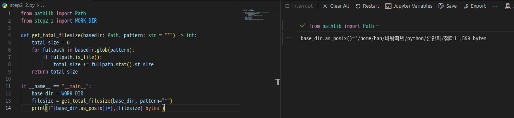
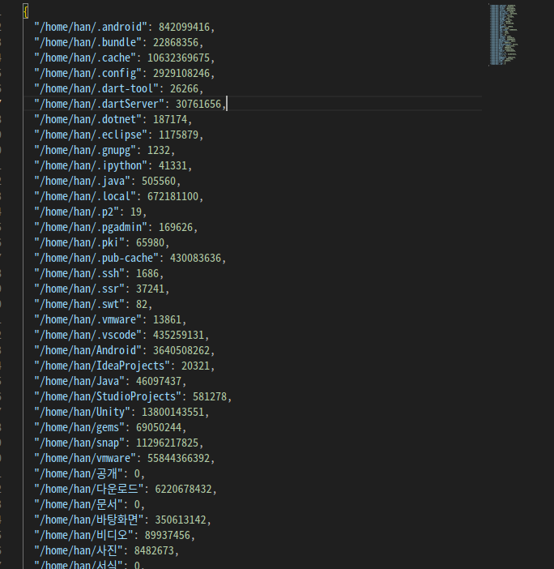
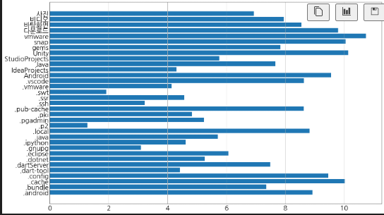

# 이번 주 회고
 

첫주부터 거하게 지각했습니다;;;

너무 오랜만에 파이썬을 공부하려니 하나도 기억이 안나서 포기할까 말까 하다가

에잇 그래도 신청했는데 다시 기초부터 공부한다는 마음으로 하면 되겠지라고 마음먹고 코드 하나하나 다시 보면서 공부했습니다..

진짜 하나도 기억이 안나서 당황했고 첨부터 다시 공부하고 오느라 좀 많이 늦었습니다.

부디 이 기억력 나쁜 학생을 용서해주시길 바랍니다 ㅠㅠ

# 1주차 학습 링크
[1주 - 1장 파일크기 측정](https://jungelec.github.io/posts/17/)

# 기본 과제
Ch01(01-1,01-2) 폴더 크기 측정 결과 화면 캡처하기

## 01-1 폴더크기 측정 결과
 

## 02-2 폴더 크기 측정 결과
 

# 추가과제
Ch.01(01-3) 폴더크기 측정 프로그램 시각화 결과화면 캡처하기

 
 
