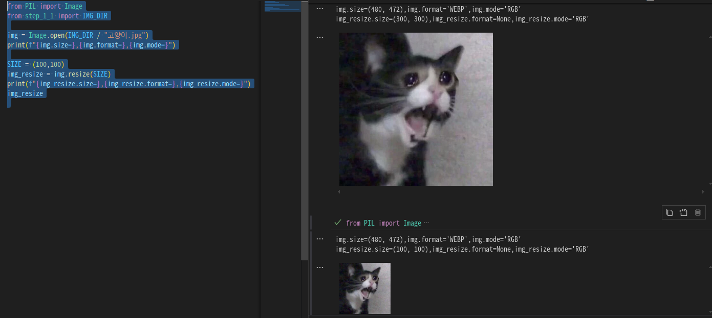
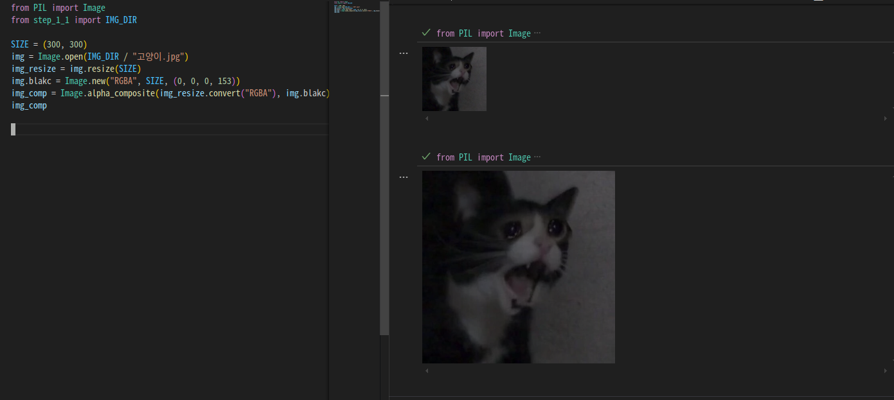
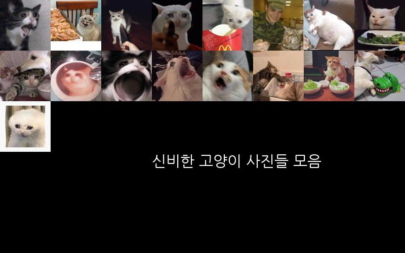

# 챕터3 이미지 콜라주
1. 이미지 불러오기
2. 이미지 가공하기
3. 이미지 콜라주 만들기

이번에도 저번주와 마찬가지로 제가 학습하면서 배운 코드들과 모듈들의 사용법들을 분석할겁니다.
불필요하게 모든 부분을 보실 필요 없습니다.

## 3.1 이미지 불러오기
```python
from PIL import Image
from PIL import ImageDraw
from step_1_1 import IMG_DIR

img = Image.open(IMG_DIR / "고양이.jpg")
# PIL 패키지로 이미지 객체를 불러옴

draw = ImageDraw.Draw(img)
# draw 모듈을 통해 이미지 객체를 보정하거나 주석을 다는등의 이미지처리 가능
draw.text(
    xy=(10, 10), 
    text ="Hello, World!", 
    fill=(255,255,255),
    fontsize=100)
# text 함수를 통해 이미지 객체 위에 문자열 추가 
# xy - 텍스트 시작점 좌표 표시
# text : 추가할 텍스트 문자열 전달
# fill :텍스트의 색상 전달
# fontsize : 텍스트의 사이즈를 전달함
img
```



## 3.2 이미지 가공하기

```python
from PIL import Image
from step_1_1 import IMG_DIR    


# Image 객체의 속성들
# filename 이미지 파일경로
# format 이미지 파일의 형식
# mode 이미지 색상모드
# size 이미지 픽셀단위 사이즈
# info 이미지와 관련된 데이터

SIZE = (300, 300)
img = Image.open(IMG_DIR / "고양이.jpg")
img_resize = img.resize(SIZE)
# 이미지 리사이즈 함수를 통해 크기를 변경
# resize(변경할 사이즈)
# 이미지 비율을 유지하면서 변경하기 위해선 ImageOps 모듈을 통해 qusrudgka
# ImageOps.contain():원본의 가로세로 비율을 유지하면서 변경

img.blakc = Image.new("RGBA", SIZE, (0, 0, 0, 153))
# new() 함수를 이용하여 이미지 객체 생성
# 검은색 이미지를 생성하고
img_comp = Image.alpha_composite(img_resize.convert("RGBA"), img.blakc)
# alpha_composite함수를 사용하여 두 이미지 객체로 알파합성함
img_comp

```


## 이미지 콜라주 만들기

```python
from pathlib import Path
from PIL import Image, ImageOps
from step_1_1 import IMG_DIR, OUT_DIR

OUT_3_2 = OUT_DIR / f"{Path(__file__).stem}.jpg"

if __name__ == "__main__":
    ROWS ,COLS = 5,8
    # 콜라주의 행과 열
    W_IMG, H_IMG = 100, 100
    # 콜라주 이미지 리사이즈 조정
    W_BG, H_BG = W_IMG * COLS, H_IMG * ROWS
    # 콜라주 이미지 배경의 크기
    start_x, start_y = 0, 0
    img_bg = Image.new("RGB", (W_BG, H_BG))
    path_sorted = sorted(IMG_DIR.glob("*.jpg"))
    for path in path_sorted:
        img = Image.open(path)
        img_fit = ImageOps.fit(img, (W_IMG, H_IMG))
        # fit함수를 이용하여 이미지의 가로세로 길이를 조정
        # resize와 같음
        img_bg.paste(img_fit, (start_x, start_y))
        # 이미지 붙여넣기
        # start_x,start_y의 위치부터 이미지 백그라운드에 조정한 사진을 넣음
        start_x += W_IMG
        # X축 좌표를 이미지 가로길이만큼 이동
        if start_x >= W_BG:
            start_x = 0
            start_y += H_IMG
    

    img_bg.save(OUT_3_2)

```
