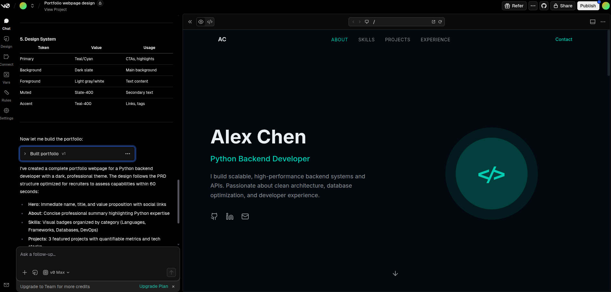
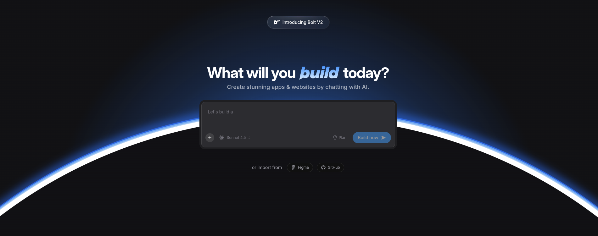
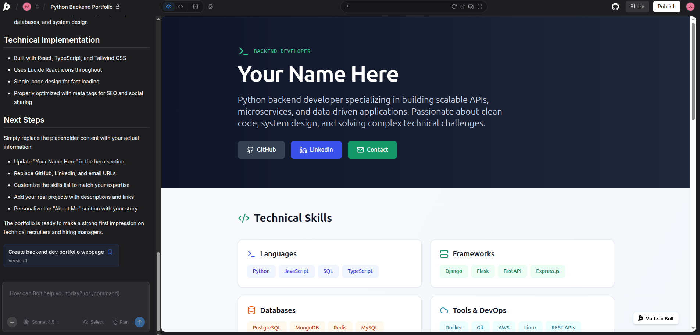
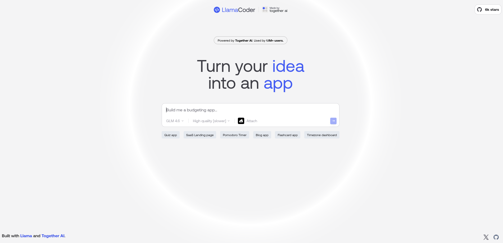
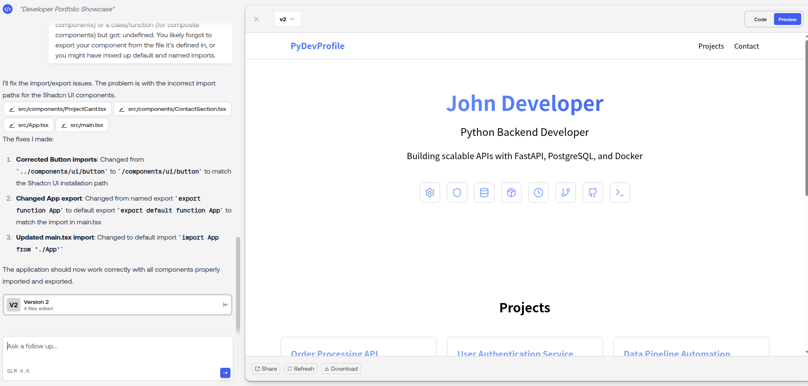
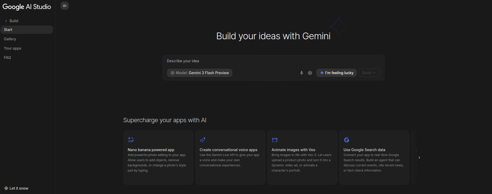
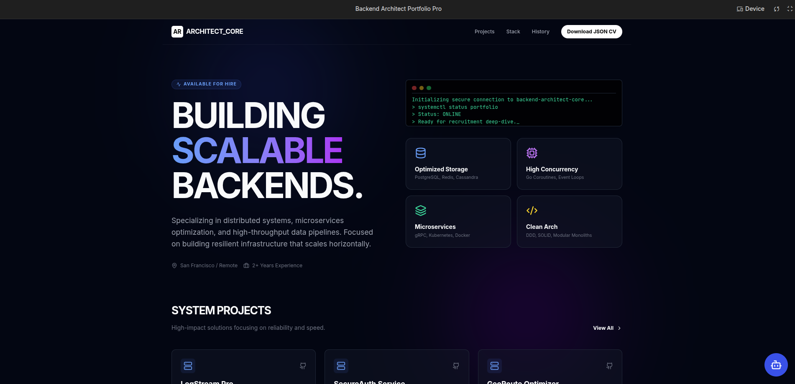

# AI는 차갑다... 유료결제는 힘들어요
오늘 클로드를 사용해보니 무료티어라고 프롬프트 몇번 하니까 유료 결제하라고 권유하더군요...

하지만 가난한 신입 개발자 입장에서는 돈이 들어가는건 다시 한번 생각해 볼 수 밖에 없는 상황입니다...

유료 플랜 2만원짜리도 결제 못하냐!라고 생각할 수 도 있지만 매일마다 코딩 AI가 발전하는 지금 바로 결제하면 뭔가 손해 볼 수도 있다는 생각과 나중에 뒤쳐지는 AI가 될 수도 있다는 생각에 조금 아깝게 느껴집니다.

그리고 다른 사이트나 툴들도 한번쯤 다 사용해보고 선택해야 후회없는 선택을 할 수 있지 않을까요?

그래서 채팅을 사용해서 웹 개발을 할 수 있는 사이트들을 모아 봤습니다.

한번씩 사용해보시면서 무료 플랜으로도 충분하다 생각되시면 계속 사용하시고 유료플랜으로 가신다면 나중에 CLI나 개발툴 소개할때 추가적으로 컨텐츠를 만들테니 그때 결정하시는걸 추천드려요

## AI 채팅 사용기

### 1. V0.dev (by Vercel)

Next.js로 유명한 Vercel의 V0입니다. 

채팅만으로 웹 UI를 만들어낸 최초의 AI툴로 알고 있습니다.

아무래도 최초로 만들어서 그런지 완성도가 높은걸로 알려저 있고 디자인 완성도가 높게 만들어 진다고 하니 나중에 예쁜 웹페이지가 필요하다면 V0를 사용해서 만들어 보는것도 좋겠습니다. 

### 2. Bolt.new

간단한 프론트엔드 웹만을 만드는 다른 AI툴들과 달리 Bolt는 단순 UI생성을 넘어 풀스택 웹앱을 만들어 줍니다.

실제로 브라우저 내에서 직접 서버를 돌리고 데이터베이스까지 연결하는 전체 웹 애플리케이션을 구축할 수 있습니다.

진짜로 풀스택을 채팅만으로 만들때 사용되는 AI툴입니다.

### 3. LlamaCoder
   

Meta의 오픈소스 모델들을 사용하여 웹앱을 만들어주는 사이트입니다.

로그인도 필요없이 완전 무료 웹 사이트로 가볍게 UI를 생성하는 웹 디자인이 필요하다면 LlamaCoder도 좋은 대안일거 같습니다.

다만 저는 처음에 코드 빌드에 실패했는데 자동으로 에러로그가 채팅에 입력되고 이를 바탕으로 다시 완성시켜주더군요

신기한 경험이였습니다 ㅋㅋ

### 4. Google AI Studio

돈이 많은 구글형님의 AI studio입니다.

마찬가지로 채팅을 통해서 웹앱을 만들어주는데 무료 토큰이 낭낭합니다.

디자인 수정만 5번, 내부 데이터 변경이나 기타등등 채팅을 끝없이 했는데 토큰이 끝이 없습니다.

특징으로 화면상에 특정 UI만을 선택해서 변경해달라고 할 수 있고 Firebase랑 연동하면 바로 웹앱으로 배포가 가능합니다.

## 웹앱 생성 AI 서비스 비용 및 특징 비교 

| 서비스명             | 무료 요금제 (Free Tier)         | 유료 요금제 (Pro) | 주요 강점                                   | 추천 대상                          |
| :------------------- | :------------------------------ | :---------------- | :------------------------------------------ | :--------------------------------- |
| **v0.dev**           | 매월 무료 크레딧 제공 ($5 상당) | $20 / 월          | 디자인 완성도, UI/UX 최적화                 | 고퀄리티 프론트엔드 개발자         |
| **Bolt.new**         | 일일 30만 / 월 100만 토큰       | $20 / 월          | 풀스택(DB/API) 연동 가능                    | 실제 기능 구현이 필요한 기획자     |
| **Google AI Studio** | **완전 무료** (가장 넉넉함)     | API 사용량 기반   | 압도적인 무료 한도, DB연동으로 앱 배포 가능 | 비용 부담 없이 대규모 개발 원할 때 |
| **LlamaCoder**       | **완전 무료** (오픈소스 기반)   | 없음              | 광고 없음, 빠르고 간결한 코드               | 가벼운 유틸리티 및 사용            |
---

