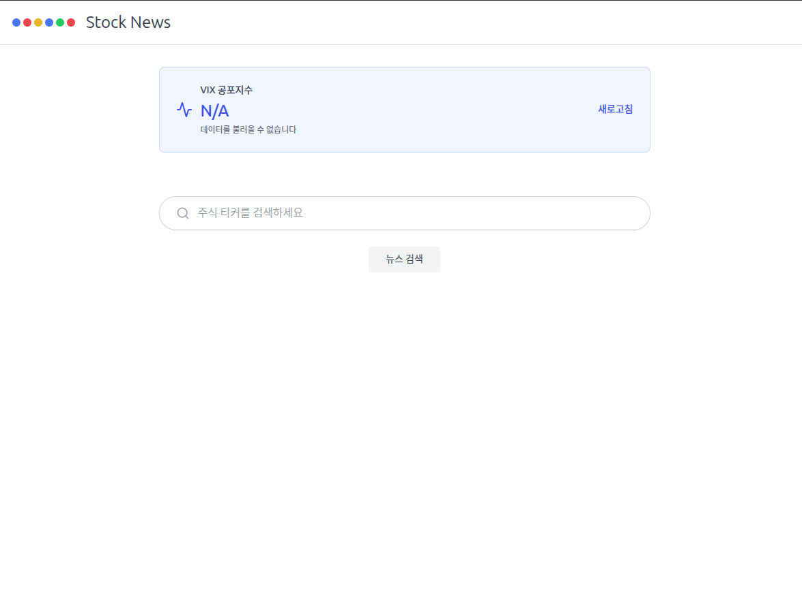
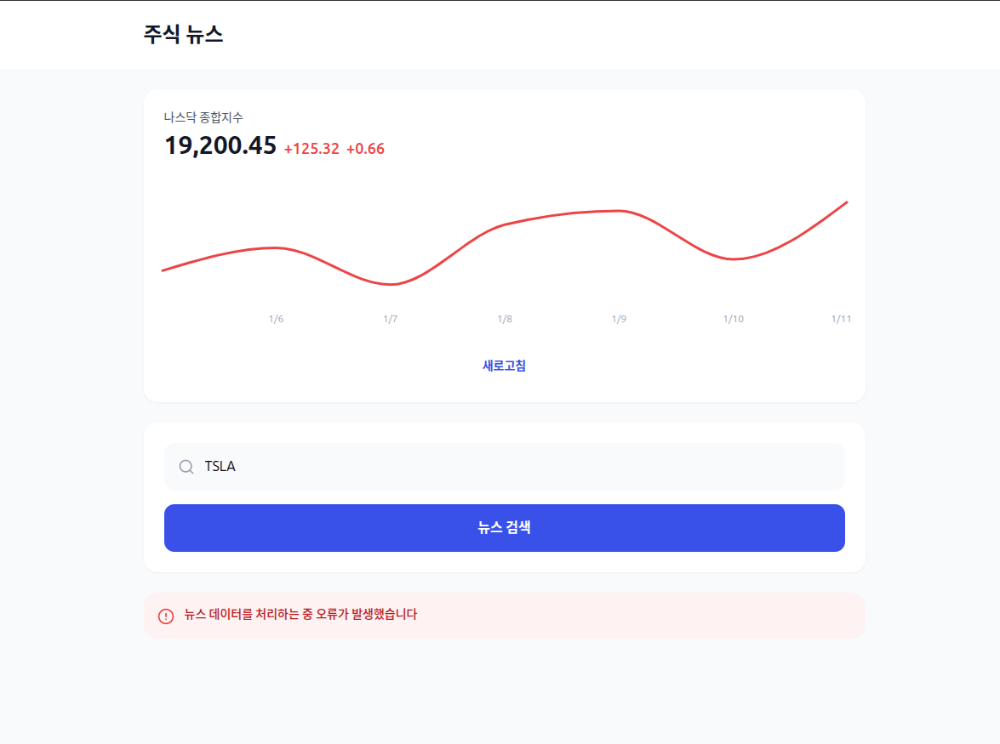
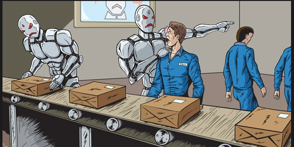

# 1주차 미션 
## 기본 미션
나의 웹사이트 캡쳐 및 게시

주식시장 티커를 입력하면 그에 맞는 검색 결과를 나타내주는 웹사이트

<a href="https://claude.ai/public/artifacts/c3f3e5f3-7d3f-4255-8747-ae998ef1c36c">게시물 링크</a>

p.33 확인문제
1. 바이크 코딩 도구 유형
   1. 웹기반 챗봇 
       Gemini,ChatGPT,Claud,perplexity
   2. 모델 선택형 
       Cursor,replit,windsurf,antigravity
   3. 전용 모델형 
      Claud code,gemini cli,codex

2. 다음 설명에 알맞은 내용

    1. 사람과 대화하듯 아이디어를 설명하면 AI가 코드를 제시하고 사용자가 검토 및 수정하며 완성하는 개발 방식  
    정답 : 바이브코딩

    2. 프로그래밍 과정에서 질문에 답하고 코드를 같이 작성해주는 가상 파트너 
    정답 : AI 어시스턴트

    3. 렌터카 처럼 여러 LLM을 고를수 있는 AI 코딩 도구 
    정답 : 모델 선택형

    4. 자가용처럼 특정모델을 선택해 깊이 사용하는 AI 도구 
    정답 : 전용 모델형

p54-55 확인 문제
1. AI어시스턴트 발전 과정을 올바르게 나열한 것은? 
    정답 : 2번 뉴럴넷 -> 딥러닝->트랜스포머 ->LLM
2. 클로드 코드와 같은 CLI모델의 특징으로 옳지 않은것을 고르세요 
   정답 : 4번 도구 사용료와 AI모델 비용을 지불한다
3. 클로드에서 코드나 문서를 생성할때 사용하는 특별한 작업 공간으로 옳은것을 고르세요
   정답 : 2번 아티팩트
4. 웹페이지를 만든 후 다른 사람들과 공유하기 위해 (게시)버튼을 클릭해야합니다.
5. 이미 게시된 웹피이지를 수정하려면 (커스터마이즈)버튼을 클릭해야 합니다.

## 추가 미션
클로드 아티팩트에서 [커스터마이즈] 2회 이상하고 캡처하기

# AI가 내 일자리를 뺏는다고요? 끼야아아악!

세상이 변해가고 있는데 그 중에서 개발자의 세상은 진짜 미친속도로 변해가는거 같습니다.

처음 AI가 등장했을 때만 해도 "오, 괜찮은데?" 정도였는데.... 

이제는 신입 뽑는 비용이면 그냥 AI도구를 굴리겠다라는 의견이 아주 많아졌습니다.

실제로도 국내 신입 개발자 채용이 20%이상 줄기도 했다는군요.

<strong> 와타시의 소중한 일자리는... 그만 AI,로봇에게...</strong>

그렇다면 우리는 이런 급변하는 상황에서 어떻게 해야할까요?

<h2>정답은 qkfh!</h2>

 
<strong><h3>만국의 노동자여 단결하라! 얻을것으...</h3></strong>

아차차 이게 아니라

이길 수 없다면 합류하라 이 마인드가 필요한 때인거 같습니다. 

이미 세상에는 AI가 주류가 되었고 앞으로는 이런 AI도구를 이용하는게 중요해질거로 예상됩니다.

이를 계속 무시하면서 사용법도 모르는채로 뒤로 밀려나기 보단 누구보다 먼저 사용해보면서 가정 적은 비용으로 그리고 빠르게 시장을 선점하는 사람이 되어야겠지요.

그것이 AI세계를 살아가는 현대인의 생존법이 아닐까요.

아무튼 잡소리들을 주저리주저리 썼는데 이번 혼공단에서는 저번처럼 빠지지 않고 공부해서 웹서비스를 만들어보는 시간이 되었으면 좋겠습니다.