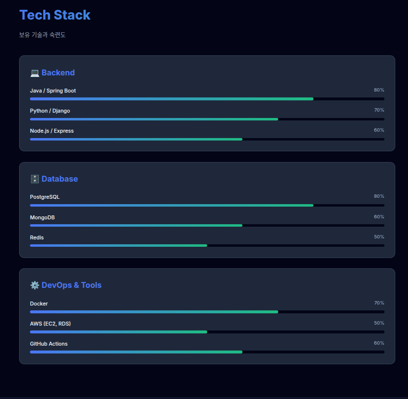

# 2주차 미션
기본 미션(필수)
PROJECT 2. 마케팅 포트폴리오 웹페이지 만들고 캡처하기
 개발자 포토폴리오로 변경해서 완성했습니다.

https://claude.ai/public/artifacts/dcc9a93d-bb15-4c34-801a-994d9c34a464

p.66, p.80-81 확인 문제 풀고 인증하기
1. 다음중 좋은 프롬프트의 조건이 아닌것은?
    3번 창의성 : 결과물이 놀라움을 주도록 유도한다.

2. 프롬프트와 PRD모두 (5W1H) 원칙을 기반으로 한다.
    이 원칙은 Why,who,when,where,how 여섯가지 질문으로 구성한다.

3. 소프트웨어 개발을 위한 PRD에서 특히 강조되어야하는 2가지 질문은 무엇인가요?
    2번 what , how

4. 아래 두 프롬프트 중 더 좋은 것은 어느 것인가요? 그 이유는 무엇인가요?
    "오늘의 날씨와 주요 뉴스를 보여주는 나만의 시작 홈페이지를 만들고 싶어"
    어떤 기능이 필요한지 구체적인 지시를 내려줌

🏃추가 미션(선택)
AI에게 디자인 수정 요청 1회 이상하고 캡처하기

내가 이해한 웹페이지의 구조를 한 문단으로 정리하기

# 2주차 학습 회고

확실히 클로드 코드는 토큰을 내주는게 조금 짠편인거 같습니다.

프롬프트 2번으로 채팅했는데 벌써 끝나다니요... 너무하네 진짜!

그래서 저는 이번에 어느 AI 코딩툴이 가난한 개발자에게 관대한지 비교 해봤습니다.

[AI 툴 비교](https://jungelec.github.io/posts/17/)

저자님께서는 Claude를 이용해서 대부분 진행하시겠지만 저는 돈이 없으니 동일한 기능을 지닌 gemini를 이용해서 진행해보겠습니다.

아마 사용법도 동일할거 같긴한데 한번 비교해보는것도 좋아보이네용!

여튼 이번 2주차는 좀 빨리 마무리 지었고 다음 3주차도 빨리 진행해서 나만의 서비스를 완성시키기 위해 노력해보겠습니다.