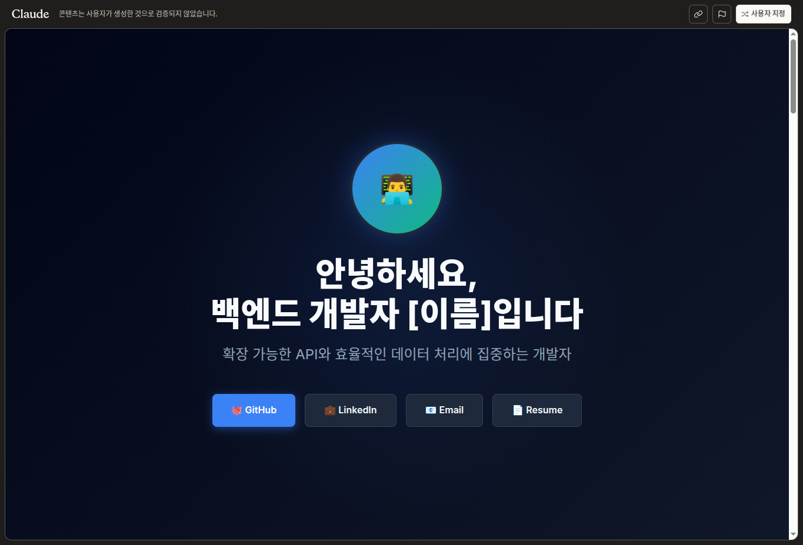
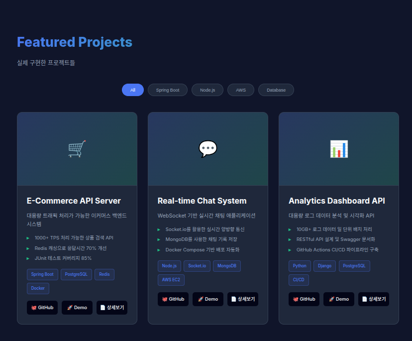
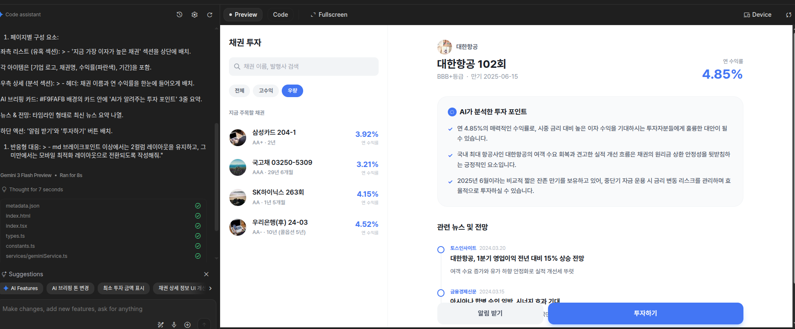

# 2주차 미션

## 기본 미션(필수)
PROJECT 2. 마케팅 포트폴리오 웹페이지 만들고 캡처하기

 개발자 포토폴리오로 변경해서 완성했습니다.




https://claude.ai/public/artifacts/dcc9a93d-bb15-4c34-801a-994d9c34a464

p.66, p.80-81 확인 문제 풀고 인증하기

1. 다음중 좋은 프롬프트의 조건이 아닌것은?
   
    3번 창의성 : 결과물이 놀라움을 주도록 유도한다.

2. 프롬프트와 PRD모두 (5W1H) 원칙을 기반으로 한다.
   
    이 원칙은 Why,who,when,where,how 여섯가지 질문으로 구성한다.

3. 소프트웨어 개발을 위한 PRD에서 특히 강조되어야하는 2가지 질문은 무엇인가요?
   
    2번 what , how

4. 아래 두 프롬프트 중 더 좋은 것은 어느 것인가요? 그 이유는 무엇인가요?
   
    "오늘의 날씨와 주요 뉴스를 보여주는 나만의 시작 홈페이지를 만들고 싶어"
    어떤 기능이 필요한지 구체적인 지시를 내려줌


## 추가 미션(선택)

AI에게 디자인 수정 요청 1회 이상하고 캡처하기


색상만 바꿔준 느낌인뎅...?

내가 이해한 웹페이지의 구조를 한 문단으로 정리하기


# 2주차 학습 회고

확실히 클로드 코드는 토큰을 내주는게 조금 짠편인거 같습니다.

프롬프트 2번으로 채팅했는데 벌써 끝나다니요... 너무하네 진짜!

그래서 저는 이번에 어느 AI 코딩툴이 가난한 개발자에게 관대한지 비교 해봤습니다.

[AI 툴 비교](https://jungelec.github.io/posts/17/)

저자님께서는 Claude를 이용해서 대부분 진행하시겠지만 저는 돈이 없으니 동일한 기능을 지닌 gemini와 AU studio를 이용해서 진행해보겠습니다.

사용법도 동일합니다.
아래는 제가 직접 개발 해보려는 채권 정보 웹 사이트의 화면이며 다음과 같은 프롬프트를 사용했습니다.

```
"토스증권 데스크탑(WTS) 및 모바일 웹 스타일의 '채권 투자 큐레이션 서비스'를 React와 Tailwind CSS로 만들어줘.

1. 핵심 레이아웃 설계:

데스크탑 (Desktop): 화면을 좌우 2컬럼으로 분할해줘.

왼쪽 컬럼(약 400px): 채권 탐색 리스트 (필터, 검색, 수익률 높은 채권 목록).

오른쪽 컬럼(나머지): 왼쪽에서 클릭한 채권의 상세 정보 (AI 요약, 뉴스, 전망, 투자하기 버튼).

모바일 (Mobile): 데스크탑의 왼쪽 컬럼(리스트)이 메인으로 보이고, 리스트 클릭 시 상세 페이지로 이동하는 일반적인 스택 구조를 유지해줘.

2. 디자인 시스템 (Toss Style):

배경색: #FFFFFF (기본), 섹션 구분 배경: #F2F4F6.

폰트: Pretendard, 숫자는 굵고 시원하게 표현.

인터랙션: 리스트 아이템에 마우스를 올리면(Hover) 부드러운 회색 배경이 나타나야 함.

3. 페이지별 구성 요소:

좌측 리스트 (유혹 섹션): > - '지금 가장 이자가 높은 채권' 섹션을 상단에 배치.

각 아이템은 [기업 로고, 채권명, 수익률(파란색), 기간]을 포함.

우측 상세 (분석 섹션): > - 헤더: 채권 이름과 연 수익률을 한눈에 들어오게 배치.

AI 브리핑 카드: #F9FAFB 배경의 카드 안에 'AI가 알려주는 투자 포인트' 3줄 요약.

뉴스 & 전망: 타임라인 형태로 최신 뉴스 요약 나열.

하단 액션: '알림 받기'와 '투자하기' 버튼 배치.

4. 반응형 대응: > - md 브레이크포인트 이상에서는 2컬럼 레이아웃을 유지하고, 그 미만에서는 모바일 최적화 레이아웃으로 전환되도록 작성해줘."
```
