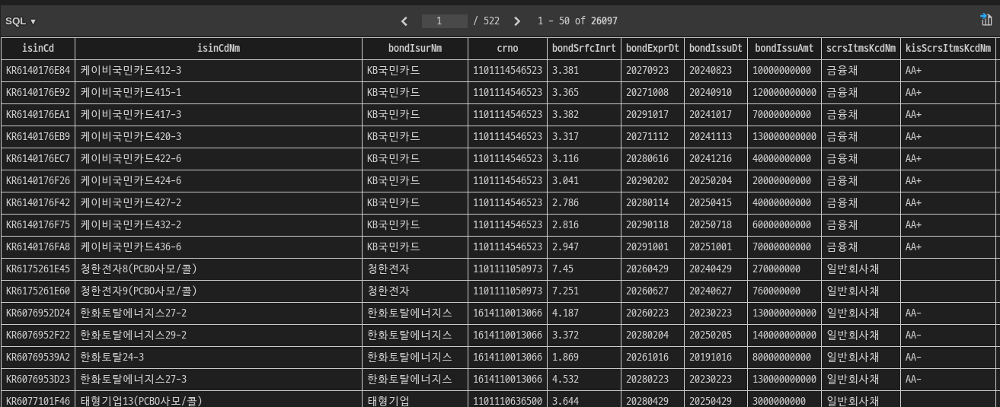

우선 기획부터 시작해서 바이브 코딩만으로 어느정도 돌아가는 서비스를 만들어 보고 싶었습니다.

처음엔 무료 제공이되는 Gemini와 상의하면서 PRD,IA와 같은 기획에 필요한 문서들을 만들어 봤습니다.


[PRD] Bond-Ease (가칭) 서비스 기획안
1. 제품 개요 (Product Overview)
   1. 서비스 정의: 채권 투자 입문자를 위한 발행 주체 분석 기반 채권 정보 큐레이션
   2. 서비스핵심 가치: "어려운 공시 데이터 대신, 이해하기 쉬운 기업 스토리와 뉴스로 채권 투자 문턱을 낮춘다."

2. 문제 정의 및 목표 (Problem & Goal)
   1. Problem기존 증권사나 SEIBro(포털)의 정보는 수치 데이터 위주로 구성되어 있음.'발행 주체가 얼마나 안전한지', '현재 어떤 상황인지' 파악하기 위해 사용자가 직접 뉴스와 공시를 찾아봐야 하는 번거로움이 존재함.
   2. Goal채권의 금리 데이터와 발행 주체(기업/국가)의 최신 동향을 결합함.투자 근거를 한 페이지에서 제공하여 투자 결정 프로세스를 단축함.

3. 주요 기능 요구사항 (Functional Requirements)
---
| 우선순위 | 기능명                | 상세 내용                                                      |
| :------- | :-------------------- | :------------------------------------------------------------- |
| **P0**   | **채권 통합 조회**    | OpenAPI를 통한 장외/장내 채권 리스트 및 금리 정보 노출         |
| **P0**   | **AI 기업/뉴스 요약** | 뉴스 API 및 LLM을 활용해 발행사 관련 최신 이슈 3줄 요약 제공   |
| **P1**   | **산업/분야 전망**    | 해당 채권이 속한 섹터(건설, IT 등)의 흐름 및 리스크 요약       |
| **P1**   | **관심 채권 알림**    | 설정한 목표 이율 도달 또는 신규 발행 시 푸시/메일 알림         |
| **P2**   | **초보자 가이드**     | 어려운 채권 용어(표면금리, YTM 등)를 툴팁이나 쉬운 용어로 변환 |
---


4. 정보 구조도 (Information Architecture)
   ```
   코드 스니펫graph TD
        A[Home: 대시보드] --> B[채권 탐색]
        A --> C[내 관심 채권]
        A --> D[채권 기초 지식]

        B --> B1[필터링: 이율/만기/신용등급]
        B1 --> B2[채권 상세 페이지]

        subgraph "상세 페이지 (Detail View)"
        B2 --> S1[채권 기본 정보: 금리, 만기일]
        B2 --> S2[발행 주체 분석: AI 뉴스 요약]
        B2 --> S3[섹터 전망: 산업 리스크/기회]
        end
    ```
    C --> C1[알림 설정: 특정 이율 도달 시]

5. 기술적 구현 아이디어 (Technical Suggestion)
   1) 데이터 수집채권 데이터: 공공데이터포털(금융위원회_채권발행정보) 또는 증권사 API 활용.뉴스 데이터: Naver/Google News API를 통해 '발행사 명' 키워드로 최신 기사 크롤링.
   2) 데이터 가공 (LLM 활용)Prompt Engineering: 수집된 뉴스 텍스트를 LLM에 전달."이 기업의 현재 재무 상태와 위기 요인을 사회 초년생이 이해하기 쉽게 3줄 요약해줘."
   3) UI/UX 시각화직관적 지표: 복잡한 표 형식 지양.시각화 요소: 카드 뉴스 형태의 레이아웃, 게이지 차트를 활용한 '안전성' 및 '수익성' 점수 시각화.


개발 목표 및 진행 사항
1.  데이터 수집 - 채권 데이터의 경우엔 openapi를 이용하여 지금현재 발행되고 있는 모든 채권들을 수집하였습니다.


<br>

2. 뉴스 수집 - naverapi를 활용하여 각 기업에 맞는 뉴스를 크롤링 후 제목으로 필터링 (재무 ,리스크, 기타등등) 예정 , 데이터 수집 코드 완성

<br>

3. 뉴스를 로컬 AI를 활용하여 분석하기 
