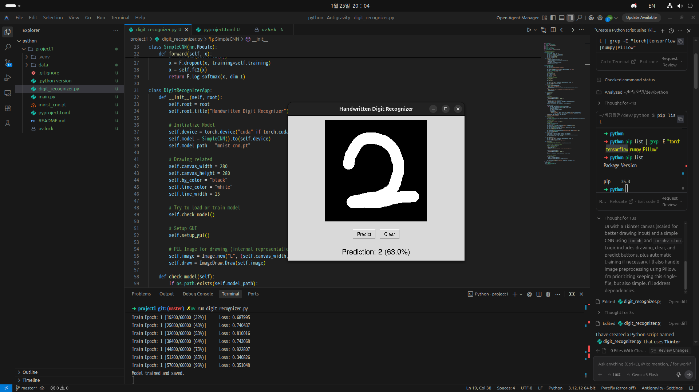
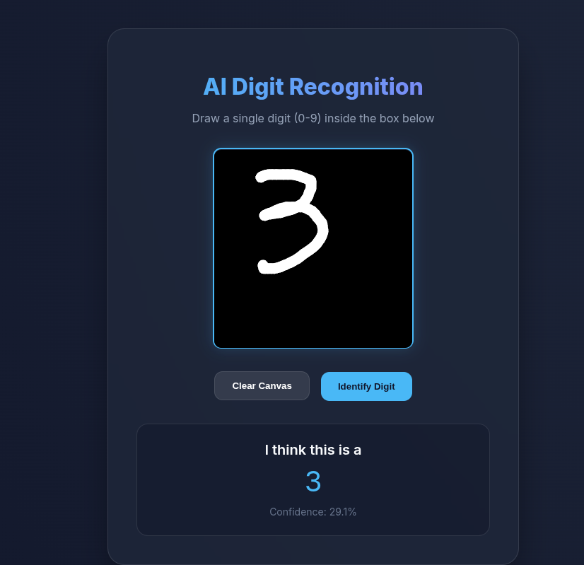

# 🚶기본 미션(필수)
PROJECT 3. 손글씨 인식 프로그램 만들고 캡처하기

⠀
# 🏃추가 미션(선택)
PROJECT 4. 손글씨 인식 프로그램 웹 버전으로 확장하고 캡처하기

# 회고
저는 지금 클로드 코드도 사용해보고 구글의 antigravity라는 새로운 IDE로 사용해보고 있는데 둘다 공포스러울 정도로 잘만들어주네요 

이젠 진짜 순수하게 언어를 밑바닥부터 배우고 공부하면서 만들어내는 개발자의 끝이 보이는걸지도 모르겠습니다.(사실 사무직군의 끝이 보이고 있는거 같아요....)

한국어로 말해도 찰떡같이 알아듣고 순식간에 만들어버리네요...

하여튼 이번에 바이브 코딩이 어떻게 동작하는지 배웠으니 저도 새롭게 하나 만들어서 봐야겠지요.

남은 3주동안 열심히 해보겠습니다.