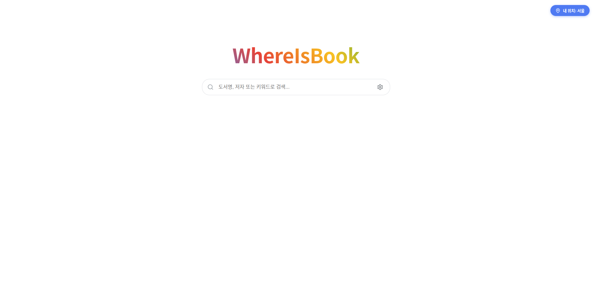
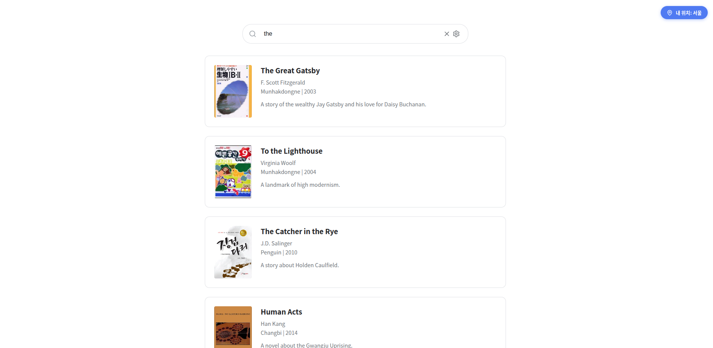
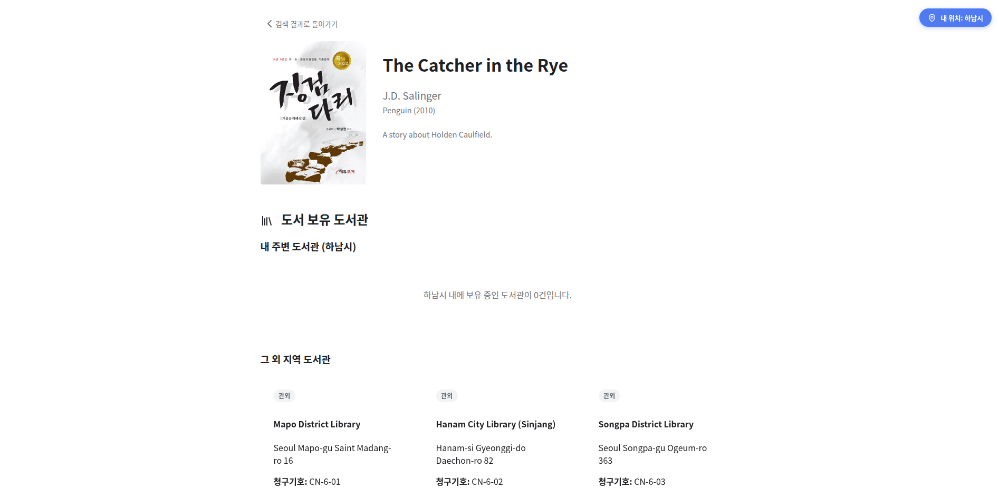

# 🚶기본 미션(필수)
PROJECT 3. 손글씨 인식 프로그램 만들고 캡처하기

⠀
# 🏃추가 미션(선택)
PROJECT 4. 손글씨 인식 프로그램 웹 버전으로 확장하고 캡처하기

# 회고
저는 지금 클로드 코드도 사용해보고 구글의 antigravity라는 새로운 IDE로 사용해보고 있는데 둘다 공포스러울 정도로 잘만들어주네요   
이젠 진짜 간단한 웹서비스는 뚝딱 만들어지니 신입 개발자분들은 조금 힘들거 같습니다.(사실 사무직군의 끝이 보이고 있는거 같아요....)  
그래도 이런걸 공부하면서 제 자신의 생산성을 높인다면 좀 오래 버틸지두 모르겠네요 ㅎㅎ 

하여튼 이번에 바이브 코딩이 어떻게 동작하는지 배웠으니 저도 새롭게 프로젝트를 시작했습니다. 
이름은 WhereisBOOK입니다. 
최근 공공 도서관에서 전자도서관을 만들면서 EBOOK을 볼 수 있게 되었는데 홍보가 잘 안되었거나 사이트들이 파편화 되어있어서 모르는 경우가 많더군요 (구독형,소장형이 따로 됨)  
거기에 책바다라는 상호대차 프로그램을 이용해서 전국에 있는 절판된 책이나 필요한 서적들도 빌려 볼 수 있는데 이 역시도 사이트가 분리되어 있어서 접근성이 매우 떨어지고요 
그래서 바이브코딩으로 모든걸 한번에 볼 수 있는 사이트를 만들어 보려고 합니다. 

아직은 국립중앙도서관의 API 승인을 받지 못해서 데이터가 없지만 flask를 이용해서 배포까지 완성했습니다. (지금은 더미 데이터만) 
위치기반으로 만들어서 자신의 위치에 따라 사용가능한 시립,도립전자도서관(EBOOK)을 먼저 검색하고 그 다음 주변 도서관 및 관외도서관 리스트로 보여드릴 예정입니다. 

웹 사이트는 좀 안예쁘네용....

https://initial5.pythonanywhere.com/

