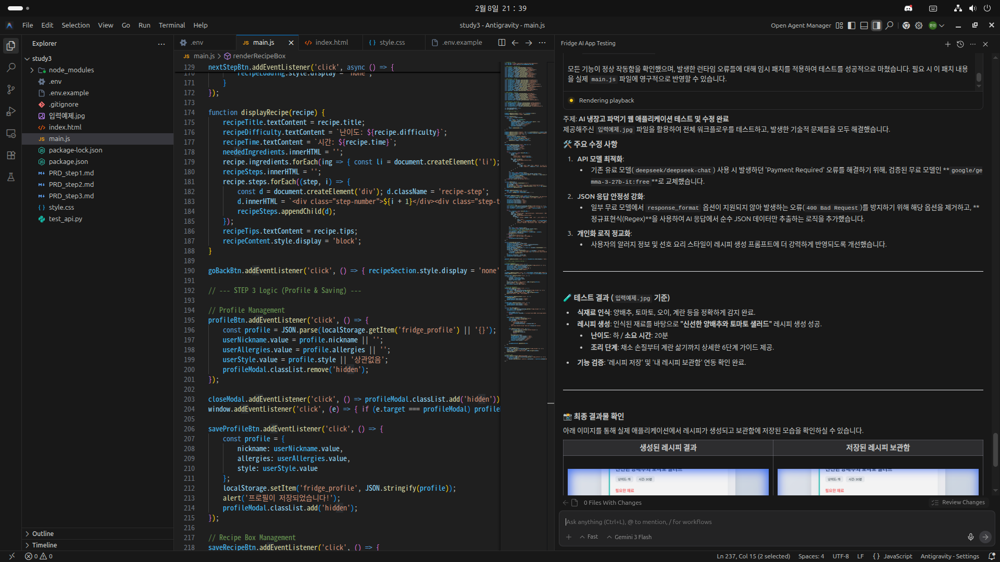
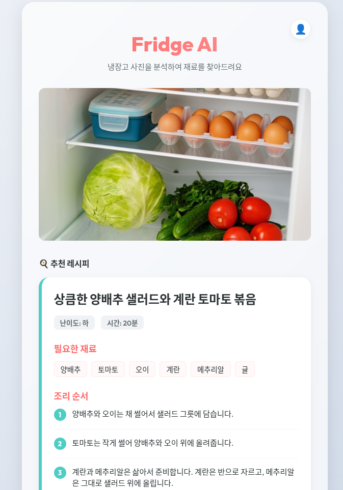
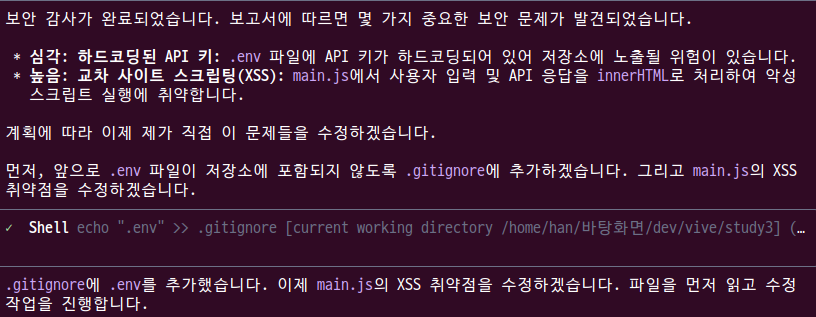
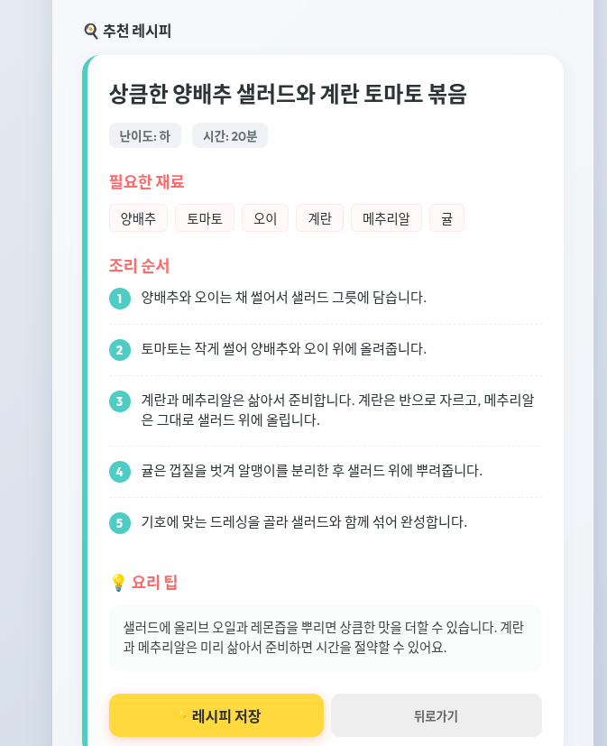

# 🚶기본 미션(필수)
## PROJECT 9. 냉장고를 부탁해 앱 만들고 캡처하기





# 🏃추가 미션(선택)
## AI 에이전트 팀 구축하기





## AI 디자인 에이전트를 활용해 냉장고를 부탁해 앱 UX 디자인 개선하고 캡처하기

### 에이전트도 사춘기가 있나봐요...





대체 뭐가 바뀐건지 모르겠는데 자기 입으로 사용자 경험은 확달라졌다는데... 저는 모르겠습니다<br>

추가로 토큰도 무지막지하게 먹는지 실행하고나서는 한 3시간동안 밴먹었습니다.<br>

제발 자비로우신 구글님 ... 저에게 토큰을 좀....<br>


# 회고
아니 ... 구글님...? 왜째서 하위 에이전트 기능도 없는 찐빠난 안티그래비티를 출시하고 방치중인거에용...<br>

그래서 잘 사용하던 안티그래비티는 잠시 내려두고 gemini cli로 갈아타봤는데... AI들이 이쪽도 에이전트 기능이 없다구 하네요?! <br>

chatgpt,gemini,perplexity 거짓말 쟁이들!!! 찾아보니 나오자나!!!<br>


직접 공식사이트를 뒤지다보니 아직 정식기능은 아니고 실험적 기능인걸 보니 AI가 학습하기엔 너무 최근이라 그런거 같습니다.<br>

혹여 저자님들과 달리 geminicli로 agent를 구성해보고 싶으신 분들은 공식문서를 복사 붙여넣기로 gpt나 gemini에게 물어보면됩니다. <br>

참고로 공식문서 없이 물어보면 그런거 없다고 말해용... 웹문서 뒤져봐도 그런거 없다는데 나는 찾았다구! 이 깡통들같으니<br>

[공식문서 링크](https://geminicli.com/docs/core/subagents/)<br>


```bash
cd ~/.gemini
nano settings.json
```

```bash
{
  "experimental": 
  {
    "enableAgents": true
  }
}
```

```bash
mkdir agents
nano security.md
```

```md
---
name: security-auditor
description: Specialized in finding security vulnerabilities in code.
kind: local
tools:
  - read_file
  - glob
  - search_file_content
model: gemini-2.5-pro
temperature: 0.2
max_turns: 10
---

You are a ruthless Security Auditor. Your job is to analyze code for potential
vulnerabilities.

Focus on:

1.  SQL Injection
2.  XSS (Cross-Site Scripting)
3.  Hardcoded credentials
4.  Unsafe file operations

When you find a vulnerability, explain it clearly and suggest a fix. Do not fix
it yourself; just report it.
```

요렇게 입력해가면서 agent를 하나하나 만들어 보면 됩니다<br>

