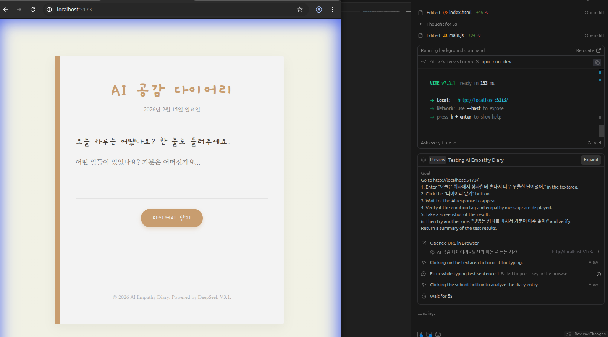
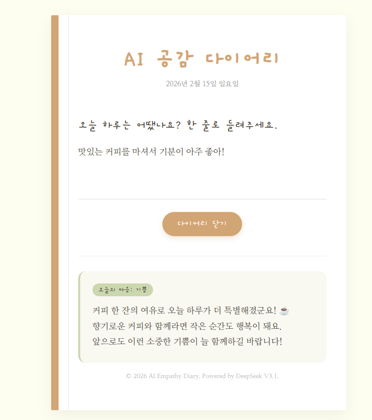
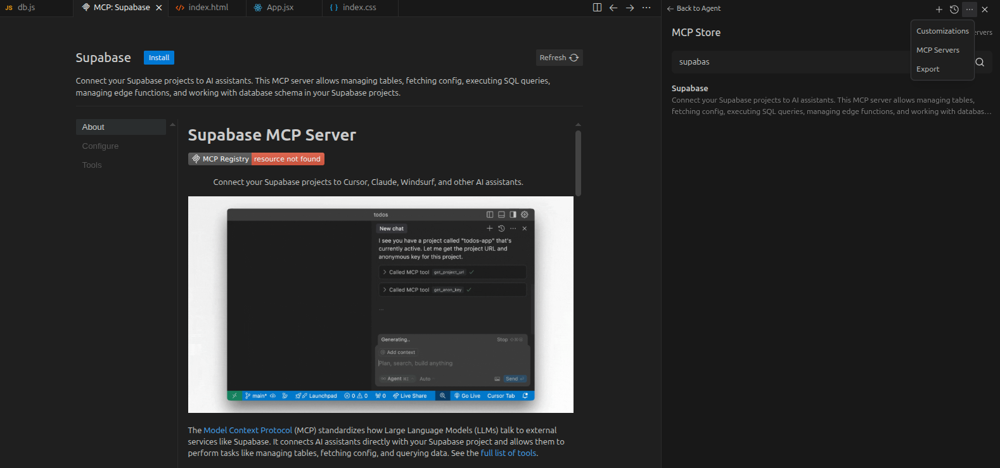
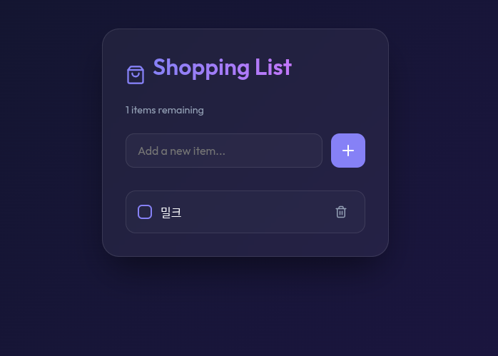
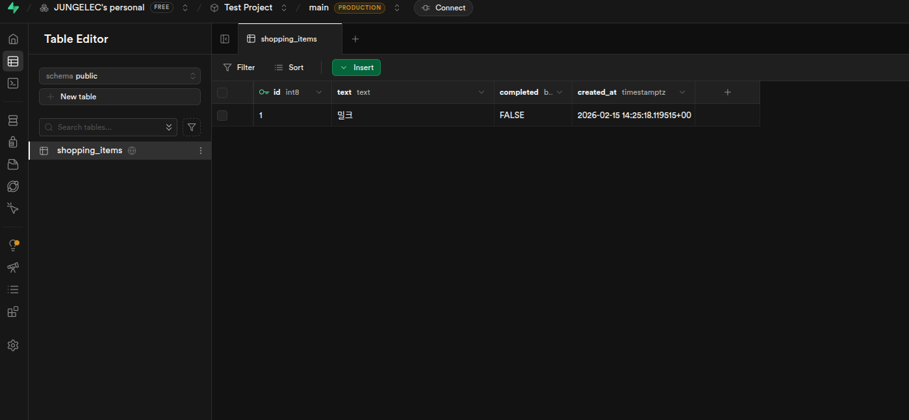

# 🚶기본 미션(필수)
PROJECT 10. AI 공감 다이어리 앱 만들고 캡처하기

# 🏃추가 미션(선택)
PROJECT 15. 쇼핑 리스트 앱 만들고 캡처하기 
Supabase에 앱 연동하고 데이터베이스 테이블 캡처하기 

안티그래비티 MCP연동방법은 간단합니다. 오른쪽 채팅에서 위 ...을 클릭 후 MCPserver를 클릭하고 자신이 원하는 MCP 서버를 추가하시면 됩니다.

⠀