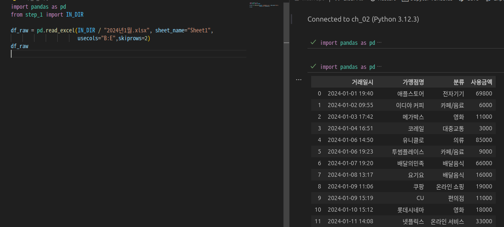
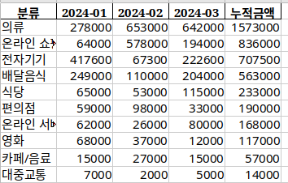
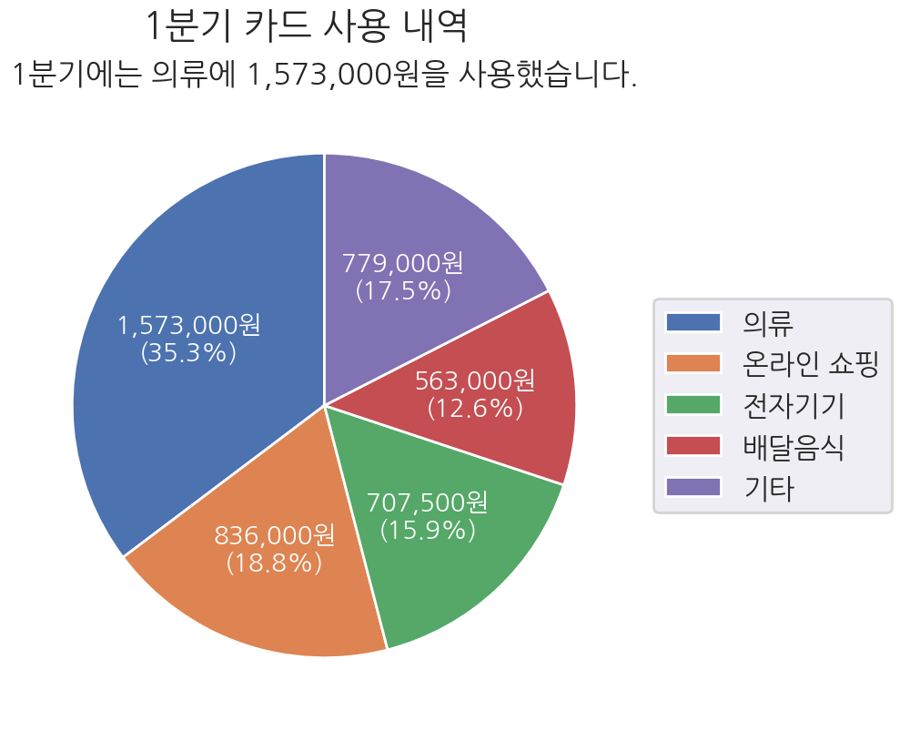

# 월별 카드 지출 내역 분석
1. 준비하기
2. 데이터 수집
3. 데이터 분석
4. 데이터 시각화

# 준비하기
필요 패키지들 설치 및 기본적인 설명

openpyxl : 파이썬에서 데이터를 엑셀파일로 저장하거나 엑셀파일을 파이썬으로 불러올 수 있게 만드는 패키지<br>
```bash
uv add openpyxl
```
pandas : 데이터 분석 분야에서 표준으로 사용되는 데이터 분석 패키지
```bash
uv add pandas
```
seaborn : mathplotlib 패키지를 기반 데이터 시각화 패키지
```bash
uv add seaborn
```

# 데이터 수집 (및 데이터 프레임 변환)
```python
from pathlib import Path
import pandas as pd
from step_1 import IN_DIR, OUT_DIR

OUT_2_2 = OUT_DIR / f"{Path(__file__).stem}.xlsx"

if __name__ == "__main__":
    result =[]
    for xlsx_path in IN_DIR.glob("2024년*월.xlsx"):
        df = pd.read_excel(xlsx_path, sheet_name="Sheet1", 
                           usecols="B:E", skiprows=2)
        # pd.read_excel() 함수는 엑셀 파일을 읽어 데이터 프레임을 반환함
        # read_excel( data, sheet_name, usecols, skiprows)
        # data: 읽어올 엑셀 파일 경로, sheet_name: 읽어올 시트 이름
        # usecols: 읽어올 열을 지정, skiprows: 건너뛸 행을 지정
        result.append(df)

    df_concat = pd.concat(result)
    # concat () 함수를 이용하여 데이터 프레임을 합침
    df_concat.to_excel(OUT_2_2, index=False)
```

데이터 프레임으로 변환한 엑셀 데이터

# 카드 지출 내역 분석하기

```python
f_raw = pd.read_excel(OUT_2_2)
df_pivot_1 = pd.pivot_table(df_raw, index="분류", values="사용금액", aggfunc="sum")
# 피벗 테이블을 이용하여 분류별 사용금액 합계를 구함
# pivot_table( data, index, values, aggfunc)
# data: 데이터 프레임, index: 행 인덱스, values: 열 인덱스, aggfunc: 집계 함수
df_pivot_1

df_raw["거래연월"] = df_raw["거래일시"].str.slice(0, 7)
# str.slice() 함수를 이용하여 거래일시에서 연월을 추출함
df_raw


df_pivot_2 = pd.pivot_table(df_raw, index="분류", columns="거래연월",
                            values="사용금액", aggfunc="sum")
# 거래연월을 열 인덱스로 추가하여 피벗 테이블을 생성
# columns: 열 인덱스
df_pivot_2["누적금액"]= df_pivot_2.sum(axis=1)
# sum(axis=1)을 이용하여 행 단위로 누적금액을 계산함
df_pivot_2

df_sort = df_pivot_2.sort_values(by="누적금액", ascending=False)
# sort_values() 함수를 이용하여 누적금액을 기준으로 내림차순
# ascending=False: 내림차순 정렬
df_sort

df_reindex = df_sort.reset_index()
# reset_index() 함수를 이용하여 인덱스를 초기화함
df_reindex

df_reindex.to_excel(OUT_DIR / f"{Path(__file__).stem}.xlsx", index=False,
                    sheet_name="분류별 누적금액")
# to_excel() 함수를 이용하여 엑셀 파일로 저장함
# index=False: 인덱스를 저장하지 않음
# sheet_name: 시트 이름 지정
```

피벗 테이블을 이용하여 분류별 거래연월에 따른  누적금액 계산된 엑셀파일


# 카드 지출 내역 시각화

```python
#데이터 프레임 분할
N =4 
df_raw = pd.read_excel(OUT_3_2)
df_head ,df_tail = df_raw.iloc[:N], df_raw.iloc[N:]
# iloc를 이용하여 상위 N개와 하위 N개 행을 추출함
df_head, df_tail

#열별 합계 계산
df_sum = df_tail.drop(columns=["분류"]).sum().to_frame().transpose()
# drop(columns=["분류"])를 이용하여 "분류" 열을 제외하고 합계를 계산함
# to_frame().transpose()를 이용하여 행으로 변환함
df_sum["분류"] = "기타"
df_sum

#데이터 프레임 연결
df_final = pd.concat([df_head, df_sum], ignore_index=True)
# concat() 함수를 이용하여 상위 N개와 하위 N개 행을 연결
# ignore_index=True: 인덱스를 초기화함
df_final

#파이 차트
values = df_final["누적금액"]

fig,ax= plt.subplots(figsize=(16, 9),dpi=100)
ax.pie(
    values, 
    textprops=dict(color="black", size=20),
    startangle=90,
    autopct="%.1f%%", 
    )
# ax.pie() 함수를 이용하여 파이 차트를 생성함
# textprops: 텍스트 속성 설정, color: 글자 색상, size: 글자 크기
# autopct: 퍼센트 표시 형식 지정
# startangle: 시작 각도를 90도로 설정하여 시계 방향으로 시작함

fig.savefig(OUT_DIR / f"{Path(__file__).stem}.png", bbox_inches="tight")
```

## 제목 레이블 범례 추가하기
```python
ax.legend(labels, bbox_to_anchor=(1, 0.5), loc="center left")
# legend() 함수를 이용하여 범례를 추가함
# bbox_to_anchor: 범례 위치 조정, loc: 범례 위치 지정
ax.set_title(f"1분기에는 {labels[0]}에 {values[0]:,}원을 사용했습니다.")
# set_title() 함수를 이용하여 제목을 설정함


fig.suptitle("1분기 카드 사용 내역")
# suptitle() 함수를 이용하여 전체 제목을 설정함
fig.savefig(OUT_DIR / f"{Path(__file__).stem}.png", bbox_inches="tight")
```

## 참고 : 리눅스 유저 한글 폰트 깨짐

```bash
sudo apt update
sudo apt install fonts-nanum
```
설치후엔 캐시를 다시 빌드합니다.
```bash
fc-cache -fv
```
이후 
```python
sns.set_theme(context="poster", font="NanumGothic")
# 맑음고딕을 나눔고딕으로 변경하면 됩니다!
```

완성된 파이형 그래프